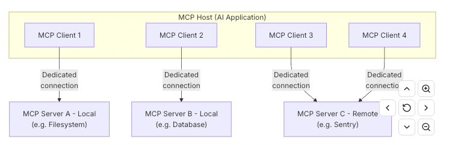

# Architecture

The key participants in the MCP architecture are:
- MCP Host: The AI application that coordinates and manages one or multiple MCP clients
- MCP Client: A component that maintains a connection to an MCP server and obtains context from an MCP server for the MCP host to use
- MCP Server: A program that provides context to MCP clients

- MCP follows a client-server architecture
- MCP host — an AI application like Claude Code or Claude Desktop — establishes connections to one or more MCP servers. The MCP host accomplishes this by creating one MCP client for each MCP server. Each MCP client maintains a dedicated connection with its corresponding MCP server.

## Local Vs Remote
Local MCP servers that use the STDIO transport typically serve a single MCP client, whereas remote MCP servers that use the Streamable HTTP transport will typically serve many MCP clients.

## Layers
MCP consists of two layers:
- Data layer: Defines the JSON-RPC based protocol for client-server communication, including lifecycle management, and core primitives, such as tools, resources, prompts and notifications.
- Transport layer: Defines the communication mechanisms and channels that enable data exchange between clients and servers, including transport-specific connection establishment, message framing, and authorization.
    - Stdio transport (Uses standard input/output streams)
    - Streamable HTTP transport (Uses HTTP POST for client-to-server messages with optional Server-Sent Events for streaming capabilities)

## Other Aspects of protocol
- MCP is a stateful protocol that requires lifecycle management.
- MCP primitives are the most important concept within MCP. They define what clients and servers can offer each other. 3 core primitives
    - Tools (Executable functions)
    - Resources (Data sources , like API, DB)
    - Prompts

- APIs: */list, */get, tools/call

- MCP also defines primitives that clients can expose. These primitives allow MCP server authors to build richer interactions.
    - Sampling (Allows servers to request language model completions from the client’s AI application. This is useful when server authors want access to a language model, but want to stay model-independent and not include a language model SDK in their MCP server. They can use the sampling/complete method to request a language model completion from the client’s AI application.)
    - Elicitation: Allows servers to request additional information from users. This is useful when server authors want to get more information from the user, or ask for confirmation of an action. They can use the elicitation/request method to request additional information from the user.
    - Logging: Enables servers to send log messages to clients for debugging and monitoring purposes.

- cross-cutting utility primitives that augment how requests are executed:
    - Tasks: Durable execution wrappers that enable deferred result retrieval and status tracking for MCP requests (e.g., expensive computations, workflow automation, batch processing, multi-step operations)

- Notifications (real-time notifications to enable dynamic updates between servers and clients. For example, when a server’s available tools change)

